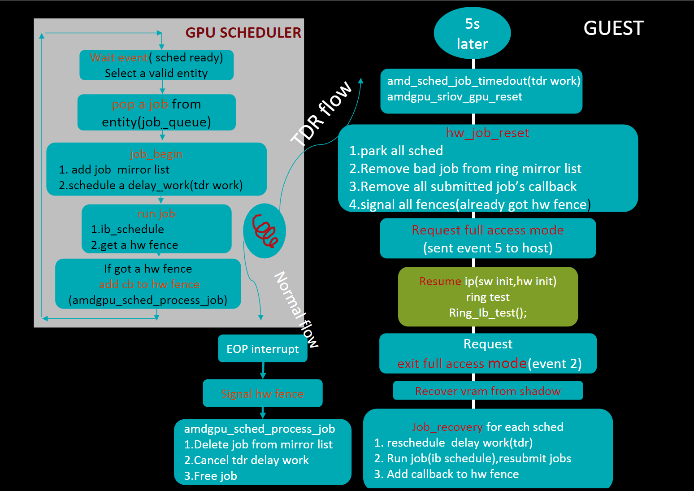

# GPU sched

说实话想要讲清楚GPU调度其实是一件很难的事情。因为GPU调度是GPU驱动一个很大的子系统，从不同的角度看，涉及了不同的知识面。这也意味着掌握了GPU调度其实也就掌握了GPU驱动的核心。所以GPU调度是非常值得花时间好好学习整理和品味的。

整个GPU驱动几乎都是建立在GPU调度之上，GPU初始化时需要建立相应的任务处理，GPU成功运行后，从UMD获取渲染命令等，通过IOCTL系统调用后，由KMD封装成job，加入调度器进行处理。从广义的层面看，GPU调度分为UMD和KMD两个部分，




## 1. 广义理解

### 1.1. UMD


### 1.2. KMD


## 2. 狭义理解
### 2.1. 主体代码 scheduler

#### 2.1.1. entity
#### 2.1.2. fence
```c
module_init(drm_sched_fence_slab_init);
module_exit(drm_sched_fence_slab_fini);
```
drm_sched_fence_slab_init

#### 2.1.3. main

### 2.2. 其他代码
#### 2.2.1. dma-fence


## 3. 功能层面
和虚拟化功能接近
### 3.1. TDR
非常值得讲一讲的


#### 3.1.1. Reference
https://confluence.amd.com/display/CLOUD/Past+Training+Presentations?preview=/68401970/542012340/Introduction%20to%20TDR.pptx

### 3.2. GIM 

#### 3.2.1. What is GIM?

GIM (GPU-IOV Module) is a Linux kernel module for AMD SR-IOV based HW Virtualization (MxGPU) product. It can support KVM, open source Xen and any other Linux kernel based hypervisors with necessary kernel compatibility modification. GIM is reponsible for:

GPU IOV initialization
Virtual function configuration and enablement
GPU scheduling for world switch
Hang detection and virtual function level reset (FLR)
PF/VF hand shake and other GPU utilities.
Currently, **only AMD S7150** series GPUs are supported.

#### 3.2.2. GIM Integration
GIM is the cross platform hypervisor driver for AMD GPUs.  It's responsible for setting up VFs (Virtual Functions) and managing the PF (Physical Function).  GIM **sets up IPs, loads golden registers, manages the SMU, and handles GPU reset and world switches, PF/VF message passing**, etc.  Most of this functionality is duplicated between GIM and the KMDs.  Ideally we'd just use the KMD for each OS to manage the hw init and GIM would just provide the SR-IOV specific bits.

#### 3.2.3. Reference
- https://github.com/GPUOpen-LibrariesAndSDKs/MxGPU-Virtualization
- https://confluence.amd.com/display/AMDGPU/GIM+Integration

### 3.3. MCBP

> amdgpu_debugfs_ib_preempt

```c 
debugfd->amdgpu_debugfs_ib_preempt
    kthread_park
        amdgpu_fence_process
```
### Micro-Engine Scheduler (MES)
tarting with navi1x, a new RISC-V core as added to the gfx block.  This engine, called MES, handles **the configuration and scheduling of gfx, sdma, and compute rings**.  

gfx这个ip，有一个特殊的引擎处理调度叫做MES，通过自己的fw向驱动提供了kiq这个接口，用来管理gfx, compute, smda的队列.
navi3x修改了将调度任务功能从驱动移到了硬件，所以KIQ接口取消，同时mes给了

- https://confluence.amd.com/display/AMDGPU/Micro+Engine+Scheduler+for+the+Linux+Graphics+Driver

#### 3.3.1. Reference
-  https://navycloud.github.io/2017/08/05/gpu-preemption-in-virtualization/

## 4. Glossary

- MES
