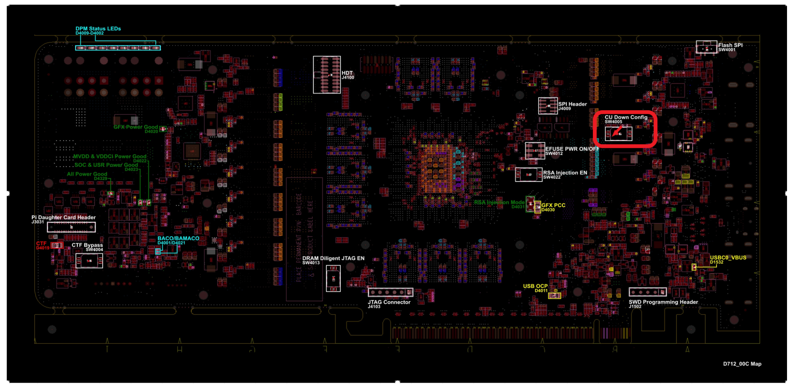

# 2022-09-22

1. 编译navi32的fw
由于是新的功能，在FW的库里存在amd-temp-navi32分支进行管理
fw branch -> amd-temp-navi32
切换到相应的temp分支后，即可进行编译

2. 确认vbios版本， 了解IFWI的使用和查看以及对pptable的影响
[[VBIOS]]

- **已确认信息**

**NAVI32 IFWI BRP022**
在window驱动测试下，D712和D711可以正常运行
在linux驱动测试下，D712成功运行，D711失败
且D711未成功运行VBIOS

**找到一个ISSUE页面**
[Navi32 Linux Post-Si 启动环境设置指南](https://confluence.amd.com/display/AMDGPU/Navi32+Linux+Post-Si+Bring-Up+Environment+Setup+Guide)

- **navi32 jtag位置**

- **debug log分析**
> [drm] psp gfx command LOAD_IP_FW(0x6) failed and response status is (0x11)

psp load ip 发送pptable到TMR域，返回0x11错误码

